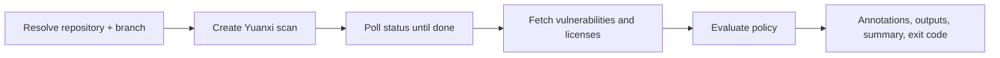

# warden-action

[简体中文](README_CN.md)

`warden-action` checks a public GitHub or Gitee repository for vulnerable dependencies and open-source license problems using the [Yuanxi security analysis platform](https://cybersec.antgroup.com/). You can run it as a **GitHub Action** or as a **Node.js CLI**.

It sends only the repository URL and branch to Yuanxi. It does not upload local files and never runs repository code.

## Contents

- [How It Works](#how-it-works)
- [Quick Start](#quick-start)
- [GitHub Action](#github-action)
- [Failure Policy](#failure-policy)
- [JSON Report](#json-report)
- [CLI](#cli)
- [Security Notes](#security-notes)
- [Development](#development)

## How It Works



1. **Resolve the target.** Uses explicit inputs, or the GitHub event, or the local Git checkout (CLI).
2. **Scan.** Submits the repository to Yuanxi and polls until the scan completes, fails, or times out.
3. **Collect results.** Fetches every page of vulnerabilities and license data. Vulnerabilities already marked as fixed (`已修复`), false positive (`误报`), or ignored (`忽略`) are left out.
4. **Evaluate the policy.** Decides `PASSED` or `FAILED` from your thresholds.

## Quick Start

1. In **Yuanxi > Team management > Access tokens**, create a token.
2. Save it as the GitHub repository secret `YUANXI_TOKEN`.
3. Add a workflow:

```yaml
name: Warden

on:
  pull_request:
  push:
    branches: [main]

jobs:
  scan:
    runs-on: ubuntu-latest
    steps:
      - uses: oss-infra/warden-action@main
        with:
          token: ${{ secrets.YUANXI_TOKEN }}
```

You do not need `actions/checkout`, because the scan runs remotely on Yuanxi.

> [!NOTE]
> These examples use `@main`. Once a `v1` tag is published, pin to `oss-infra/warden-action@v1`.

## GitHub Action

### Scan Target

If you set both `repository` and `branch`, the Action uses them as-is and works with any event. If you don't, it works them out from the event:

| Event                                   | Repository                  | Branch                     |
| --------------------------------------- | --------------------------- | -------------------------- |
| `pull_request`, `pull_request_target`   | PR head (source) repository | PR head (source) branch    |
| `push`, `workflow_dispatch`, `schedule` | Event repository            | Branch from `refs/heads/*` |

Pull requests are scanned from their source branch, not the base branch or GitHub's temporary merge ref. Tag pushes do not point to a branch, so set `branch` explicitly for them.

GitHub and Gitee HTTPS URLs get a `.git` suffix if they don't already have one, because Yuanxi expects it.

### Fork Pull Requests

GitHub does not give repository secrets to `pull_request` workflows triggered from forks. To scan public fork PRs, use `pull_request_target`:

```yaml
on:
  pull_request_target:
    types: [opened, synchronize, reopened]

permissions:
  contents: read

jobs:
  scan:
    runs-on: ubuntu-latest
    steps:
      - uses: oss-infra/warden-action@main
        with:
          token: ${{ secrets.YUANXI_TOKEN }}
```

> [!WARNING]
> This Action never checks out or runs pull request code. When you use `pull_request_target`, don't add steps to the same job that check out or run untrusted PR code.

### Inputs

| Input                      | Default                         | Description                                                                      |
| -------------------------- | ------------------------------- | -------------------------------------------------------------------------------- |
| `token`                    | **required**                    | Yuanxi access token                                                              |
| `scan_type`                | `all`                           | `security`, `licenses`, or `all` (aliases: `stc` = security, `sca` = licenses)   |
| `repository`               | from event                      | Public GitHub/Gitee repository URL                                               |
| `branch`                   | from event                      | Branch to scan                                                                   |
| `project_name`             | generated                       | Stable Yuanxi project name, 1-30 characters                                      |
| `fail_on_severity`         | `high`                          | Lowest blocking severity: `warning`, `low`, `medium`, `high`, `critical`, `none` |
| `fail_on_license_conflict` | `true`                          | Fail when the project license conflicts with a component license                 |
| `fail_on_license_risk`     | `false`                         | Fail when a component license is flagged as risky                                |
| `enforce_policy`           | `true`                          | `false` = review mode: report findings as warnings without failing the job       |
| `timeout_seconds`          | `1200`                          | Maximum time to wait for the scan                                                |
| `poll_interval_seconds`    | `10`                            | Delay between status checks                                                      |
| `api_base_url`             | `https://cybersec.antgroup.com` | Yuanxi API origin                                                                |
| `debug`                    | `false`                         | Log API requests and full responses, with secrets redacted                       |

If you omit `project_name`, it is built from the repository name and branch. Names longer than 30 characters are shortened and given a short hash so they stay unique and stable.

### Outputs

| Output              | Description                              |
| ------------------- | ---------------------------------------- |
| `result`            | `PASSED` or `FAILED`                     |
| `status`            | Final Yuanxi scan status                 |
| `project_id`        | Yuanxi project ID                        |
| `scan_id`           | Yuanxi scan task ID                      |
| `share_link`        | Report link, if Yuanxi returns one       |
| `vulnerabilities`   | Number of open vulnerabilities           |
| `license_risks`     | Number of components with risky licenses |
| `license_conflicts` | Number of project license conflicts      |
| `json`              | Full [structured report](#json-report)   |

The Action also writes a job summary and adds annotations. It shows up to 20 per category, with the most severe vulnerabilities first. Blocking findings are errors and everything else is a warning.

### Using the Report in Later Steps

```yaml
- uses: oss-infra/warden-action@main
  id: warden
  with:
    token: ${{ secrets.YUANXI_TOKEN }}
    enforce_policy: false

- if: always() && steps.warden.outputs.json != ''
  env:
    WARDEN_REPORT: ${{ steps.warden.outputs.json }}
  run: printf '%s\n' "$WARDEN_REPORT" | jq . > warden-report.json
```

For complete examples, see [.github/workflows/pull-request.yml](.github/workflows/pull-request.yml) (a PR gate that blocks merges) and [.github/workflows/warden.yml](.github/workflows/warden.yml) (a self scan in review mode, with a manual trigger and a DingTalk notification).

## Failure Policy

The result is `FAILED` if **any** of these is true:

- a vulnerability's severity is at or above `fail_on_severity`;
- `fail_on_license_conflict` is `true` and there is at least one license conflict;
- `fail_on_license_risk` is `true` and at least one component license is flagged as risky.

Severity levels, from lowest to highest:

| Input value | Yuanxi rank |
| ----------- | ----------- |
| `warning`   | 警告        |
| `low`       | 低危        |
| `medium`    | 中危        |
| `high`      | 高危        |
| `critical`  | 严重        |

`none` turns off vulnerability-based failures.

The defaults block `high` and `critical` vulnerabilities and any license conflict. Risky component licenses are reported but don't block.

`enforce_policy` only decides what happens to the job, not the result:

| `enforce_policy` | Policy result  | Job outcome                          |
| ---------------- | -------------- | ------------------------------------ |
| `true`           | `FAILED`       | Step fails                           |
| `false`          | `FAILED`       | Step passes; findings are warnings   |
| any              | scan/API error | Step fails, and `result` is `FAILED` |

Use `enforce_policy: true` for pull request gates. Use `false` for scheduled or informational scans.

## JSON Report

Both the `json` output and `warden --json` produce the same versioned report:

```jsonc
{
  "schemaVersion": "1.0",
  "target":  { "repository": "...", "branch": "main", "scanType": "all" },
  "scan":    { "status": "扫描完成", "projectName": "...", "projectId": "...", "scanId": "...",
               "shareLink": "...", "projectPackage": "JAVA(Maven)", "licensePackage": "maven" },
  "result":  "FAILED",
  "summary": { "vulnerabilities": 3, "blockingVulnerabilities": 1, "licenseRisks": 0, "licenseConflicts": 1 },
  "details": {
    "vulnerabilities": [], "licenses": [],
    "blockingVulnerabilities": [], "licenseRisks": [], "licenseConflicts": []
  }
}
```

`details` keeps every field Yuanxi returns, including new ones that are not listed here.

## CLI

You need Node.js 24 or later.

```bash
pnpm install
cp .env.example .env          # then set YUANXI_TOKEN
pnpm warden                   # scan the current checkout's origin + branch
```

The CLI reads the token from `--token`, `WARDEN_TOKEN`, or `YUANXI_TOKEN`, and also loads `.env`. By default it scans `remote.origin.url` on the current branch. Pass options to override:

```bash
pnpm warden \
  --repository https://github.com/example/project \
  --branch main \
  --scan-type security \
  --fail-on-severity critical \
  --json
```

CLI options follow the Action inputs, using kebab-case (for example `--fail-on-severity`). The CLI also has `--json` (print the report to stdout) and `--help`. Progress and debug logs go to stderr, so stdout stays machine-readable.

| Exit code | Meaning                                             |
| --------- | --------------------------------------------------- |
| `0`       | Policy passed                                       |
| `1`       | Policy failed                                       |
| `2`       | Configuration, network, API, scan, or timeout error |

## Security Notes

- Yuanxi requires the token as a URL query parameter. The Action registers it as a secret so GitHub masks it in logs, and `debug` output redacts it. Don't turn on HTTP tracing (such as `NODE_DEBUG=http`) in CI.
- Each API request times out after 60 seconds. The whole scan is limited by `timeout_seconds`.
- Only public repositories are supported, because Yuanxi clones the repository itself.

## Development

```bash
git clone git@github.com:oss-infra/warden-action.git
cd warden-action
pnpm install
pnpm check        # typecheck + test + build
```

| Path                    | Responsibility                                         |
| ----------------------- | ------------------------------------------------------ |
| `src/action.ts`         | GitHub Action entry: inputs, annotations, outputs      |
| `src/cli.ts`            | CLI entry: argument parsing, Git defaults, exit codes  |
| `src/config.ts`         | Input validation and normalization into `ScanConfig`   |
| `src/github-context.ts` | Scan target resolution from GitHub event payloads      |
| `src/run.ts`            | Wires the API client, scanner, and policy together     |
| `src/scanner.ts`        | Scan lifecycle: create, poll, paginate results         |
| `src/api-client.ts`     | Yuanxi HTTP client, error handling, debug redaction    |
| `src/policy.ts`         | Severity thresholds and pass/fail evaluation           |
| `src/format.ts`         | Human-readable messages and the structured JSON report |
| `src/types.ts`          | Yuanxi API and internal types                          |

`dist/index.js` (Action) and `dist/cli/index.js` (CLI) are committed bundles. Run `pnpm build` and commit `dist/` after any change under `src/`.

## References

- [Yuanxi security analysis platform](https://cybersec.antgroup.com/)
- [YASA Engine](https://github.com/antgroup/YASA-Engine)
