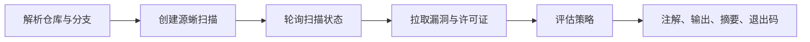

# warden-action

[English](README.md)

`warden-action` 借助[源蜥安全分析平台](https://cybersec.antgroup.com/)，检查公开 GitHub 或 Gitee 仓库中的依赖漏洞和开源许可证问题。它可以作为 **GitHub Action** 使用，也可以作为 **Node.js 命令行工具**使用。

它只把仓库地址和分支发给源蜥，不上传本地文件，也不会执行仓库代码。

## 目录

- [工作原理](#工作原理)
- [快速开始](#快速开始)
- [GitHub Action](#github-action)
- [失败策略](#失败策略)
- [JSON 报告](#json-报告)
- [命令行工具](#命令行工具)
- [安全说明](#安全说明)
- [开发](#开发)

## 工作原理



1. **确定目标**：依次使用显式输入、GitHub 事件，或本地 Git 仓库（仅 CLI）。
2. **扫描**：把仓库提交给源蜥，然后轮询，直到扫描完成、失败或超时。
3. **收集结果**：拉取所有分页的漏洞和许可证数据。已标记为 `已修复`、`误报` 或 `忽略` 的漏洞会被排除。
4. **评估策略**：根据阈值得出 `PASSED` 或 `FAILED`。

## 快速开始

1. 在**源蜥 > 团队管理 > 访问令牌**中创建令牌。
2. 把它保存为 GitHub 仓库 Secret `YUANXI_TOKEN`。
3. 添加工作流：

```yaml
name: Warden

on:
  pull_request:
  push:
    branches: [main]

jobs:
  scan:
    runs-on: ubuntu-latest
    steps:
      - uses: oss-infra/warden-action@main
        with:
          token: ${{ secrets.YUANXI_TOKEN }}
```

扫描在源蜥远程执行，所以不需要 `actions/checkout`。

> [!NOTE]
> 示例使用 `@main`。发布 `v1` 标签后，建议固定为 `oss-infra/warden-action@v1`。

## GitHub Action

### 扫描目标

如果同时设置了 `repository` 和 `branch`，Action 会直接使用这两个值，并且适用于任意事件。否则，Action 会根据事件自动确定：

| 事件                                    | 仓库               | 分支                    |
| --------------------------------------- | ------------------ | ----------------------- |
| `pull_request`、`pull_request_target`   | PR 来源（head）仓库 | PR 来源（head）分支      |
| `push`、`workflow_dispatch`、`schedule` | 事件仓库           | `refs/heads/*` 对应分支 |

PR 扫描的是来源分支，不是目标分支，也不是 GitHub 临时生成的 merge ref。推送标签时没有对应分支，请显式设置 `branch`。

如果 GitHub/Gitee HTTPS 地址没有 `.git` 后缀，会自动补上，因为源蜥要求这种格式。

### Fork PR

GitHub 不会把仓库 Secrets 提供给由 fork 触发的 `pull_request` 工作流。要扫描公开 fork 的 PR，请使用 `pull_request_target`：

```yaml
on:
  pull_request_target:
    types: [opened, synchronize, reopened]

permissions:
  contents: read

jobs:
  scan:
    runs-on: ubuntu-latest
    steps:
      - uses: oss-infra/warden-action@main
        with:
          token: ${{ secrets.YUANXI_TOKEN }}
```

> [!WARNING]
> 本 Action 不会 checkout 或执行 PR 代码。使用 `pull_request_target` 时，不要在同一个 job 中加入 checkout 或执行不可信 PR 代码的步骤。

### 输入参数

| 参数                       | 默认值                          | 说明                                                                |
| -------------------------- | ------------------------------- | ------------------------------------------------------------------- |
| `token`                    | **必填**                        | 源蜥访问令牌                                                        |
| `scan_type`                | `all`                           | `security`、`licenses` 或 `all`（别名：`stc` = security，`sca` = licenses） |
| `repository`               | 事件解析                        | 公开 GitHub/Gitee 仓库地址                                          |
| `branch`                   | 事件解析                        | 要扫描的分支                                                        |
| `project_name`             | 自动生成                        | 稳定的源蜥项目名，1-30 个字符                                       |
| `fail_on_severity`         | `high`                          | 触发阻断的最低等级：`warning`、`low`、`medium`、`high`、`critical`、`none` |
| `fail_on_license_conflict` | `true`                          | 项目许可证与组件许可证冲突时失败                                    |
| `fail_on_license_risk`     | `false`                         | 组件许可证被标记为风险时失败                                        |
| `enforce_policy`           | `true`                          | 设为 `false` 即 review 模式：问题只以 warning 报告，不使任务失败    |
| `timeout_seconds`          | `1200`                          | 等待扫描完成的最长时间                                              |
| `poll_interval_seconds`    | `10`                            | 两次状态查询之间的间隔                                              |
| `api_base_url`             | `https://cybersec.antgroup.com` | 源蜥 API 地址                                                       |
| `debug`                    | `false`                         | 输出 API 请求和完整响应，敏感信息已脱敏                             |

不设置 `project_name` 时，会用仓库名和分支生成项目名。超过 30 个字符的名称会被截断并加上短哈希，确保名称唯一且稳定。

### 输出参数

| 参数                | 说明                                   |
| ------------------- | -------------------------------------- |
| `result`            | `PASSED` 或 `FAILED`                   |
| `status`            | 源蜥最终扫描状态                       |
| `project_id`        | 源蜥项目 ID                            |
| `scan_id`           | 源蜥扫描任务 ID                        |
| `share_link`        | 报告链接（源蜥返回时才有）             |
| `vulnerabilities`   | 待处置漏洞数量                         |
| `license_risks`     | 许可证有风险的组件数量                 |
| `license_conflicts` | 项目许可证冲突数量                     |
| `json`              | 完整的[结构化报告](#json-报告)         |

Action 还会写入 job summary 并添加注解。每类注解最多 20 条，漏洞按严重程度从高到低排列。阻断项显示为 error，其余显示为 warning。

### 在后续步骤中使用报告

```yaml
- uses: oss-infra/warden-action@main
  id: warden
  with:
    token: ${{ secrets.YUANXI_TOKEN }}
    enforce_policy: false

- if: always() && steps.warden.outputs.json != ''
  env:
    WARDEN_REPORT: ${{ steps.warden.outputs.json }}
  run: printf '%s\n' "$WARDEN_REPORT" | jq . > warden-report.json
```

完整示例见 [.github/workflows/pull-request.yml](.github/workflows/pull-request.yml)（阻断合并的 PR 门禁）和 [.github/workflows/warden.yml](.github/workflows/warden.yml)（review 模式的自扫描，可手动触发并发送钉钉通知）。

## 失败策略

满足以下**任一**条件时，结果为 `FAILED`：

- 有漏洞的等级达到或高于 `fail_on_severity`；
- `fail_on_license_conflict` 为 `true`，并且至少有一个许可证冲突；
- `fail_on_license_risk` 为 `true`，并且至少有一个组件许可证被标记为风险。

漏洞等级从低到高：

| 输入值     | 源蜥等级 |
| ---------- | -------- |
| `warning`  | 警告     |
| `low`      | 低危     |
| `medium`   | 中危     |
| `high`     | 高危     |
| `critical` | 严重     |

`none` 表示漏洞不会导致失败。

默认情况下，高危、严重漏洞和任何许可证冲突都会导致失败。风险组件许可证只报告，不阻断。

`enforce_policy` 只决定任务是否失败，不影响结果：

| `enforce_policy` | 策略结果     | 任务表现                        |
| ---------------- | ------------ | ------------------------------- |
| `true`           | `FAILED`     | step 失败                       |
| `false`          | `FAILED`     | step 通过，问题以 warning 报告  |
| 任意             | 扫描/API 异常 | step 失败，`result` 为 `FAILED` |

PR 门禁请使用 `enforce_policy: true`，定时扫描或仅供参考的扫描请使用 `false`。

## JSON 报告

`json` 输出与 `warden --json` 生成的是同一种带版本号的报告：

```jsonc
{
  "schemaVersion": "1.0",
  "target":  { "repository": "...", "branch": "main", "scanType": "all" },
  "scan":    { "status": "扫描完成", "projectName": "...", "projectId": "...", "scanId": "...",
               "shareLink": "...", "projectPackage": "JAVA(Maven)", "licensePackage": "maven" },
  "result":  "FAILED",
  "summary": { "vulnerabilities": 3, "blockingVulnerabilities": 1, "licenseRisks": 0, "licenseConflicts": 1 },
  "details": {
    "vulnerabilities": [], "licenses": [],
    "blockingVulnerabilities": [], "licenseRisks": [], "licenseConflicts": []
  }
}
```

`details` 保留源蜥返回的全部字段，包括此处没有列出的新字段。

## 命令行工具

需要 Node.js 24 或更高版本。

```bash
pnpm install
cp .env.example .env          # 然后设置 YUANXI_TOKEN
pnpm warden                   # 扫描当前仓库的 origin 和当前分支
```

CLI 从 `--token`、`WARDEN_TOKEN` 或 `YUANXI_TOKEN` 读取令牌，也会加载 `.env`。默认扫描当前分支的 `remote.origin.url`，可以用参数覆盖：

```bash
pnpm warden \
  --repository https://github.com/example/project \
  --branch main \
  --scan-type security \
  --fail-on-severity critical \
  --json
```

CLI 参数与 Action 输入一一对应，但使用短横线命名（例如 `--fail-on-severity`）。CLI 还支持 `--json`（把报告输出到 stdout）和 `--help`。进度和调试日志写到 stderr，所以 stdout 可以直接交给程序解析。

| 退出码 | 含义                                   |
| ------ | -------------------------------------- |
| `0`    | 策略通过                               |
| `1`    | 策略未通过                             |
| `2`    | 配置、网络、API、扫描失败或超时错误   |

## 安全说明

- 源蜥要求把令牌放在 URL 查询参数中。Action 会把令牌注册为 secret，让 GitHub 在日志中屏蔽它，`debug` 输出也会脱敏。请勿在 CI 中开启 HTTP 跟踪（例如 `NODE_DEBUG=http`）。
- 每个 API 请求 60 秒超时。整个扫描受 `timeout_seconds` 限制。
- 只支持公开仓库，因为由源蜥自行克隆仓库。

## 开发

```bash
git clone git@github.com:oss-infra/warden-action.git
cd warden-action
pnpm install
pnpm check        # 类型检查 + 测试 + 构建
```

| 路径                    | 职责                                         |
| ----------------------- | -------------------------------------------- |
| `src/action.ts`         | Action 入口：读取输入、注解、输出           |
| `src/cli.ts`            | CLI 入口：参数解析、Git 默认值、退出码      |
| `src/config.ts`         | 校验并规范化输入，生成 `ScanConfig`         |
| `src/github-context.ts` | 从 GitHub 事件解析扫描目标                  |
| `src/run.ts`            | 组装 API 客户端、扫描器和策略               |
| `src/scanner.ts`        | 扫描生命周期：创建、轮询、分页拉取          |
| `src/api-client.ts`     | 源蜥 HTTP 客户端、错误处理、调试脱敏        |
| `src/policy.ts`         | 等级阈值与通过/失败判定                     |
| `src/format.ts`         | 可读文本消息与结构化 JSON 报告              |
| `src/types.ts`          | 源蜥 API 与内部类型                         |

`dist/index.js`（Action）和 `dist/cli/index.js`（CLI）是提交到仓库的打包产物。修改 `src/` 后，请执行 `pnpm build` 并提交 `dist/`。

## 参考资料

- [源蜥安全分析平台](https://cybersec.antgroup.com/)
- [YASA Engine](https://github.com/antgroup/YASA-Engine)
